Out of ~800 entries, 12 of mine placed in the top 100. I am keeping a record of these algorithms and results so that hopefully I can fine-tune my algorithm and do better next year. 

Next to each bracket is a short description of how it varies from my best bracket, which teams performed better in real life than in my algorithm by more than one game (overachievers), and which teams performed better in my algorithm than in real life by more than one game (underachievers).

**\#20 overall** - [Bracket 32](./32.js) *best algorithm*
###### Overachievers
Wichita State, NC State, Louisville, Michigan State, 
###### Underachievers
Kansas, Villanova, Iowa State, Eastern Washington
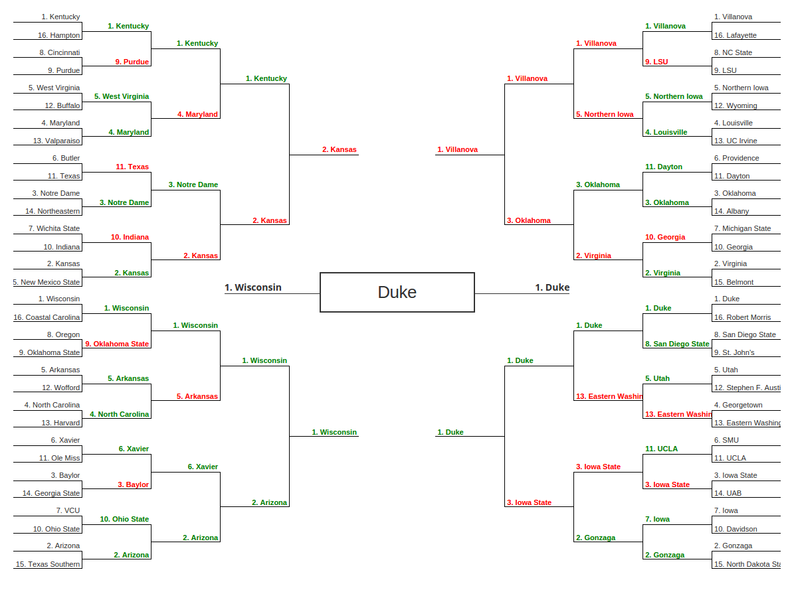

**\#26 overall** - [Bracket 8](./8.js) *shooting percentages worth more, official rank worth less*
###### Overachievers
Wichita State, Kentucky, NC State, Louisville, Michigan State, Xavier
###### Underachievers
West Virginia, Kansas, Oklahoma, Lafayette, Iowa State, Ole Miss
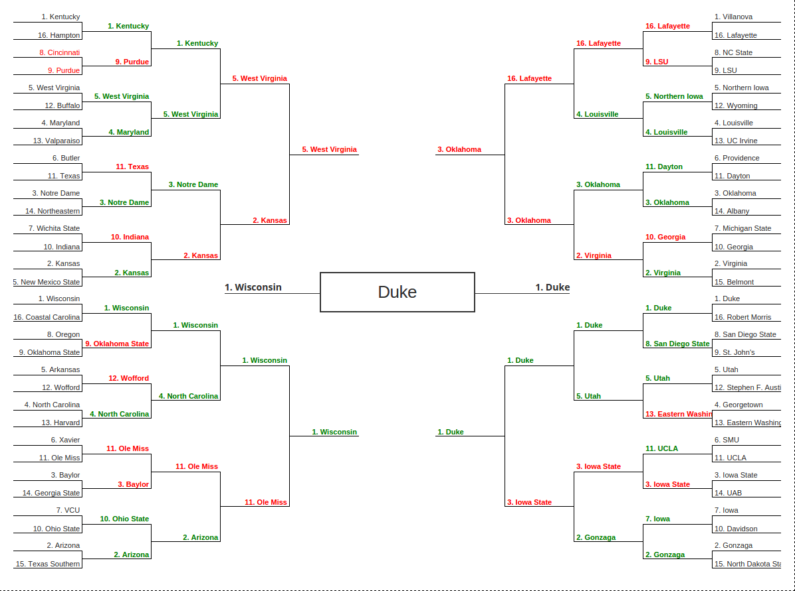

**\#27 overall** - [Bracket 15](./15.js) *shooting percentages worth more, official rank worth less*
###### Overachievers
Wichita State, Kentucky, NC State, Louisville, Michigan State
###### Underachievers
Maryland, Kansas, Villanova, Providence, Iowa State

**\#29 overall** - [Bracket 46](./46.js) *RPI/CONF_SOS worth more*
###### Overachievers
Wichita State, Kentucky, NC State, Louisville, Michigan State, UCLA, Xavier
###### Underachievers
Maryland, Kansas, Villanova, Providence, Iowa State
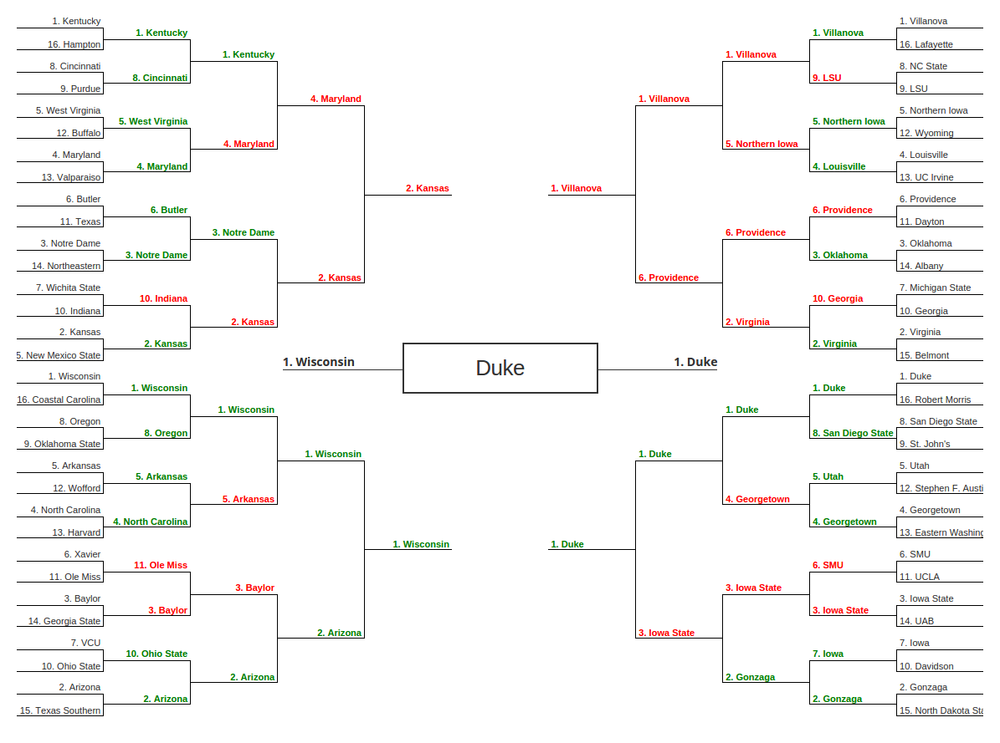

**\#40 overall** - [Bracket 113](./113.js) *RPI/CONF_SOS worth less, shooting percentages not factored, official rank worth more, personal biases, seed difference factors less*
###### Overachievers
West Virginia, Notre Dame, Wichita State, Michigan State
###### Underachievers
Buffalo, Texas, Indiana, Villanova, Virginia, Providence, Baylor
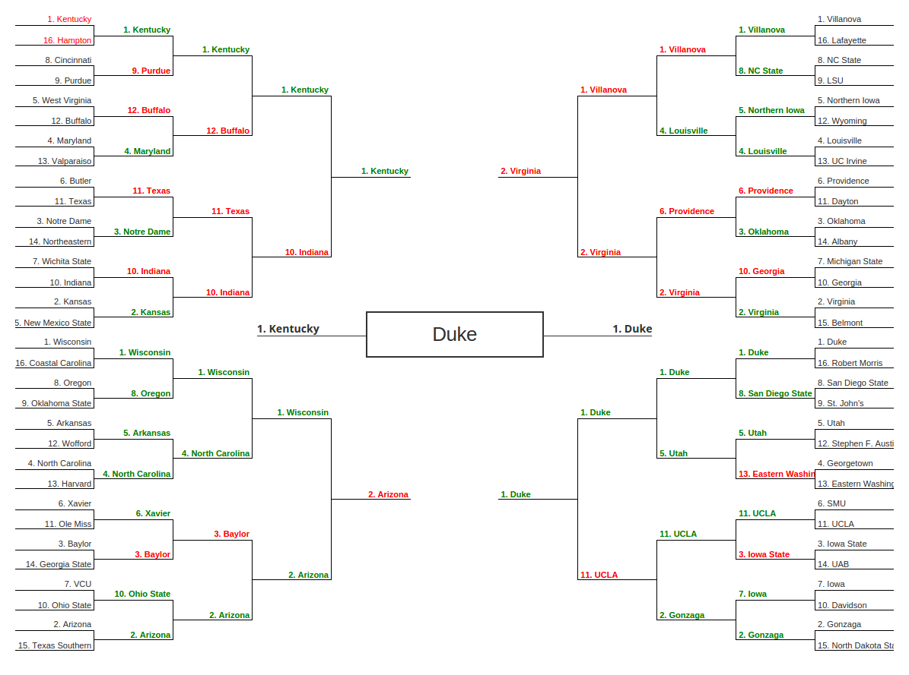

**\#51 overall** - [Bracket 124](./124.js) *RPI/CONF_SOS worth less, shooting percentages not factored, official rank worth more, personal biases, seed difference factors less*
###### Overachievers
Notre Dame, Xavier, NC State, Louisville, Michigan State, Gonzaga
###### Underachievers
Butler, Villanova, Virginia, Ole Miss, Davidson, Iowa State
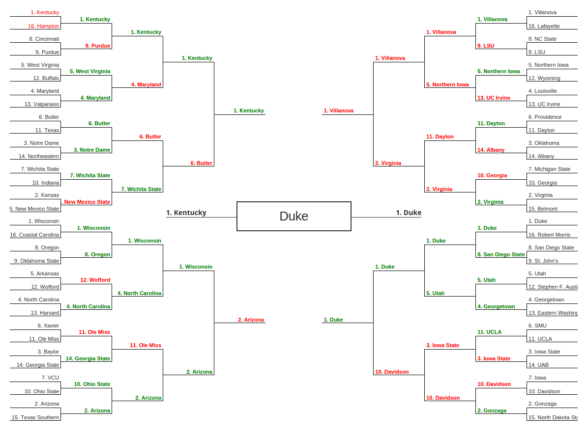

**\#55 overall** - [Bracket 118](./118.js) *RPI/CONF_SOS worth less, shooting percentages not factored, official rank worth more, personal biases, seed difference factors less*
###### Overachievers
Wichita State, NC State, Louisville, Oklahoma, Michigan State, Utah, Gonzaga, Wisconsin
###### Underachievers
Kansas, Villanova, Virginia, UC Irvine, Stephen F. Austin, North Carolina
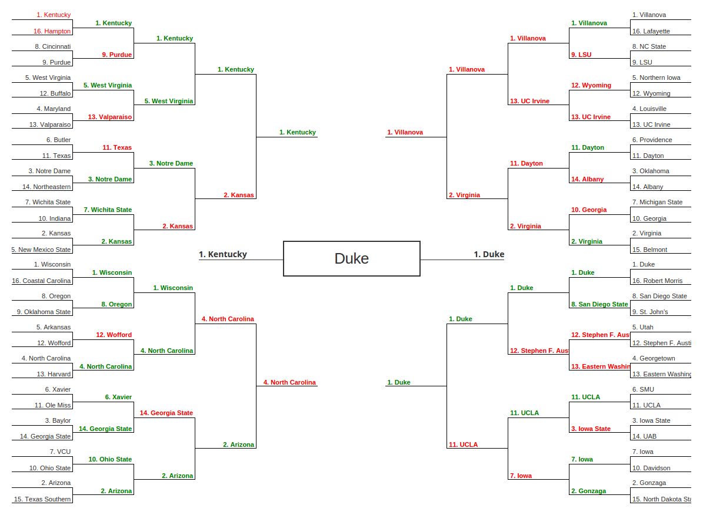

**\#63 overall** - [Bracket 101](./101.js) *RPI/CONF_SOS worth less, shooting percentages not factored, official rank worth more, personal biases, seed difference factors less*
###### Overachievers
Wichita State, Louisville, Michigan State, Utah, Gonzaga, Xavier, Wisconsin
###### Underachievers
Kansas, Northern Iowa, Providence, Stephen F. Austin, Wofford, Baylor, Iowa, Iowa State
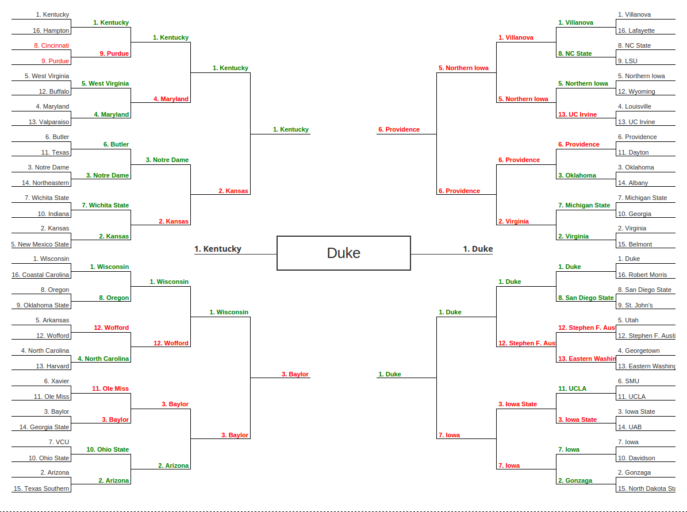

**\#68 overall** - [Bracket 50](./50.js) *RPI/CONF_SOS worth slightly less, shooting percentages worth less*
###### Overachievers
Xavier, Wisconsin, Michigan State, UCLA
###### Underachievers
SMU, Baylor
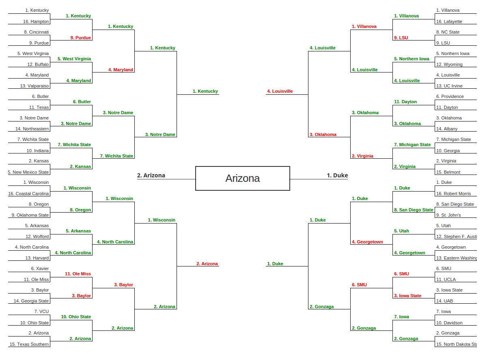

**\#68 overall** - [Bracket 108](./108.js) *RPI/CONF_SOS worth less, shooting percentages not factored, official rank worth more, personal biases, seed difference factors less*
###### Overachievers
NC State, Louisville, Michigan State, Wisconsin, Xavier, Utah, UCLA, Gonzaga
###### Underachievers
Villanova, Virginia, North Carolina, Baylor, Eastern Washington, SMU, Iowa
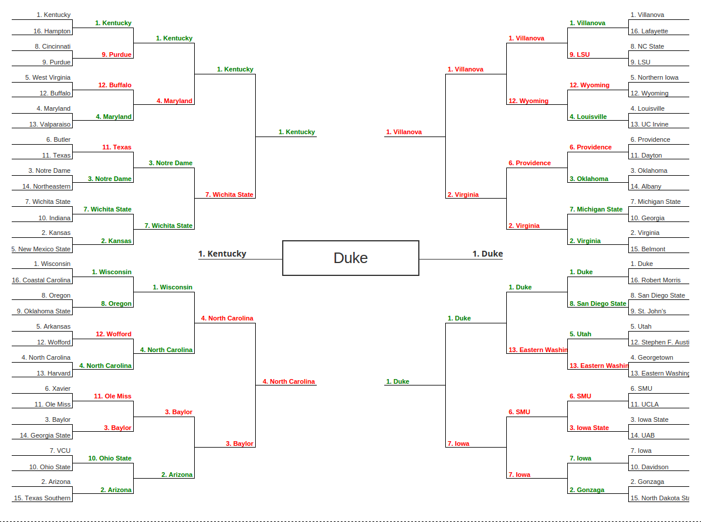

**\#71 overall** - [Bracket 112](./112.js) *RPI/CONF_SOS worth less, shooting percentages not factored, official rank worth more, personal biases, seed difference factors less*
###### Overachievers
Wichita State, NC State, Michigan State, Xavier, Wisconsin, Gonzaga
###### Underachievers
Kansas, Villanova, UC Irvine, Eastern Washington, Iowa, Iowa State, Wofford, Baylor
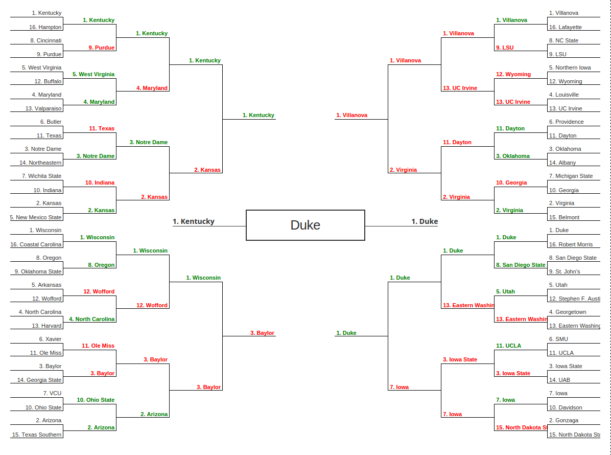

**\#92 overall** - [Bracket 57](./57.js) *RPI/CONF_SOS worth slightly less, shooting percentages worth less, RPI x win% worth more, official rank worth more*
###### Overachievers
Wichita State, NC State, UCLA
###### Underachievers
Kansas, Iowa State
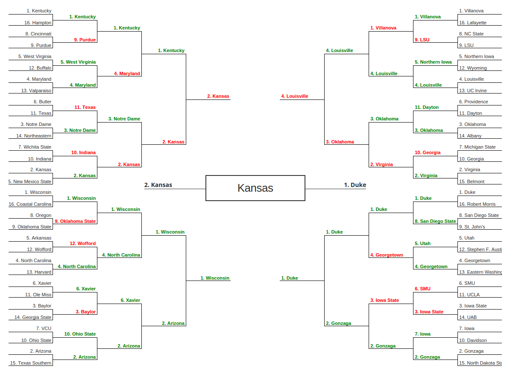
