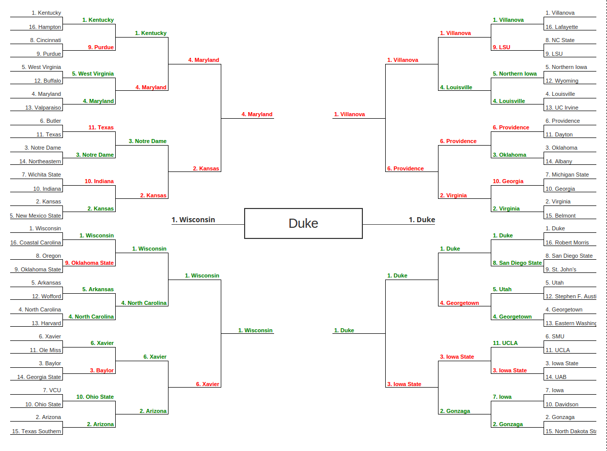

Out of ~800 entries, 12 of mine placed in the top 100. I am keeping a record of these algorithms and results so that hopefully I can fine-tune my algorithm and do better next year. 

Next to each bracket is a short description of how it varies from my best bracket, which teams performed better in real life than in my algorithm (overachievers), and which teams performed better in my algorithm than in real life (underachievers).

**\#20 overall** - [Bracket 32](./32.js) *best algorithm*
###### Overachievers
some teams
###### Underachievers
some teams

**\#26 overall** - [Bracket 8](./8.js) *shooting percentages worth more, official rank worth less*
###### Overachievers
some teams
###### Underachievers
some teams

**\#27 overall** - [Bracket 15](./15.js) *shooting percentages worth more, official rank worth less*
###### Overachievers
some teams
###### Underachievers
some teams

**\#29 overall** - [Bracket 46](./46.js) *RPI/CONF_SOS worth more*
###### Overachievers
some teams
###### Underachievers
some teams

**\#40 overall** - [Bracket 113](./113.js) *RPI/CONF_SOS worth less, shooting percentages not factored, official rank worth more, personal biases, seed difference factors less*
###### Overachievers
some teams
###### Underachievers
some teams

**\#51 overall** - [Bracket 124](./124.js) *RPI/CONF_SOS worth less, shooting percentages not factored, official rank worth more, personal biases, seed difference factors less*
###### Overachievers
some teams
###### Underachievers
some teams

**\#55 overall** - [Bracket 118](./118.js) *RPI/CONF_SOS worth less, shooting percentages not factored, official rank worth more, personal biases, seed difference factors less*
###### Overachievers
some teams
###### Underachievers
some teams

**\#63 overall** - [Bracket 101](./101.js) *RPI/CONF_SOS worth less, shooting percentages not factored, official rank worth more, personal biases, seed difference factors less*
###### Overachievers
some teams
###### Underachievers
some teams

**\#68 overall** - [Bracket 50](./50.js) *RPI/CONF_SOS worth slightly less, shooting percentages worth less*
###### Overachievers
some teams
###### Underachievers
some teams

**\#68 overall** - [Bracket 108](./108.js) *RPI/CONF_SOS worth less, shooting percentages not factored, official rank worth more, personal biases, seed difference factors less*
###### Overachievers
some teams
###### Underachievers
some teams

**\#71 overall** - [Bracket 112](./112.js) *RPI/CONF_SOS worth less, shooting percentages not factored, official rank worth more, personal biases, seed difference factors less*
###### Overachievers
some teams
###### Underachievers
some teams

**\#92 overall** - [Bracket 57](./57.js) *RPI/CONF_SOS worth slightly less, shooting percentages worth less, RPI x win% worth more, official rank worth more*
###### Overachievers
some teams
###### Underachievers
some teams

