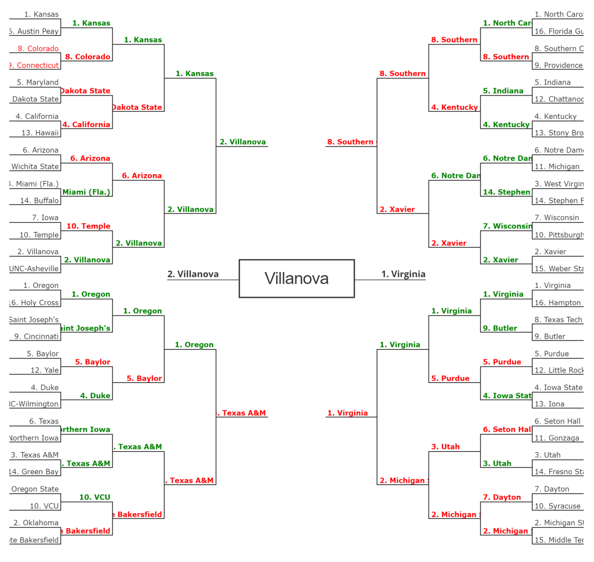

Out of 550 entries, 50 of mine placed in the top 100! I had all of the top 5 submissions, 8 of the top 10, and 17 of the top 25.

- Submitted 50 brackets using [random1.js](./algorithms/random1.js)
 - 5 of those brackets were in the 90th percentile or better
    - #2 overall
 - 19 of those brackets were in the 40th percentile or worse

- Submitted 50 brackets using [random2.js](./algorithms/random2.js)
 - 1 of those brackets were in the 90th percentile or better
    - 
 - 28 of those brackets were in the 40th percentile or worse

- Submitted 1 bracket using [jsseph_mov_rpi.js](./algorithms/jsseph_mov_rpi.js) (I ran this algorithm 25 times and beyond the first round, the results were nearly identical, so I figured there was no need to submit multiple brackets using this algorithm)
 - It did well, scoring 940 points, which put it in the 94.7 percentile
 - 

- Submitted 24 brackets using [danmanstx.js](./algorithms/danmanstx.js)
 - This algorithm heavily favors UNC and Michigan State. Mostly it just likes higher seeds advancing.
 - 0 of those brackets were in the 90th percentile or better
 - 1 of those brackets were in the 40th percentile or worse
 
- Submitted 75 brackets using [2015_57.js](./algorithms/2015_57.js) (using conference sos stats from 2015...oops!)
 - 6 of those brackets were in the 90th percentile or better
    - 
 - 30 of those brackets were in the 40th percentile or worse

- Submitted 50 brackets using [2015_57.js](./algorithms/2015_57.js) (using [conference sos stats from 2016](http://www.cbssports.com/collegebasketball/bracketology/conference/rpi/2015-16))
 - 5 of those brackets were in the 90th percentile or better
    - #1 overall
 - 11 of those brackets were in the 40th percentile or worse

- Submitted 50 brackets using [2015_50.js](./algorithms/2015_50.js) (using [conference sos stats from 2016](http://www.cbssports.com/collegebasketball/bracketology/conference/rpi/2015-16))
 - 9 of those brackets were in the 90th percentile or better
    - #4 overall
 - 11 of those brackets were in the 40th percentile or worse

- Submitted 50 brackets using [naive_cinderella.js](./algorithms/naive_cinderella.js)
 - 8 of those brackets were in the 90th percentile or better
    - #3 overall
 - 15 of those brackets were in the 40th percentile or worse

- Submitted 50 brackets using [cinderella.js](./algorithms/cinderella.js)
 - 6 of those brackets were in the 90th percentile or better
    - #5 overall
 - 24 of those brackets were in the 40th percentile or worse

- Submitted 50 brackets using [graduated_cinderella.js](./algorithms/graduated_cinderella.js)
 - 5 of those brackets were in the 90th percentile or better
    - 
 - 26 of those brackets were in the 40th percentile or worse

- Submitted 4 brackets using [true_shooting_percentage.js](./algorithms/true_shooting_percentage.js)
 - I used shooting tolerances of 0.008, 0.01, 0.02, and 0.03
 - They all did poorly.

- Submitted 46 brackets using [true_shooting_percentage_with_randomness.js](./algorithms/true_shooting_percentage_with_randomness.js) with a shooting tolerance of 0.02 (Duke and Michigan St. are highly favored by this algorithm)
 - 0 of those brackets were in the 90th percentile or better
 - 26 of those brackets were in the 40th percentile or worse

- Submitted 10 brackets using [dean_oliver.js](./algorithms/dean_oliver.js)
 - 0 of those brackets were in the 90th percentile or better
 - 8 of those brackets were in the 40th percentile or worse

- Submitted 50 brackets using [defense.js](./algorithms/defense.js)
 - 5 of those brackets were in the 90th percentile or better
    - 
 - 21 of those brackets were in the 40th percentile or worse